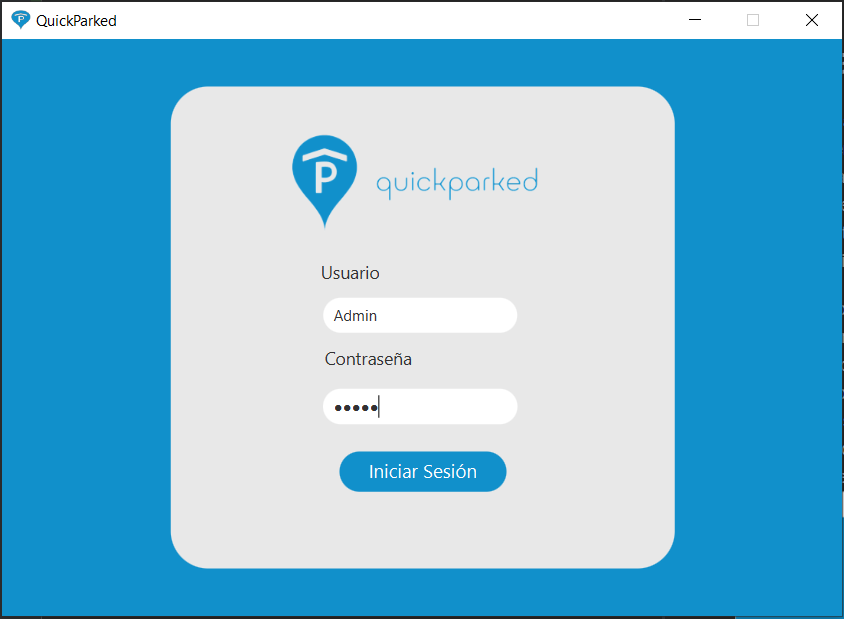
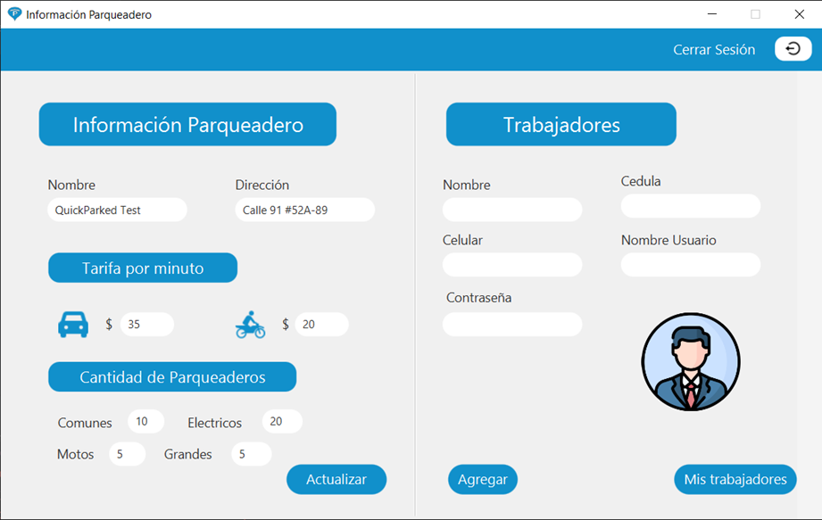
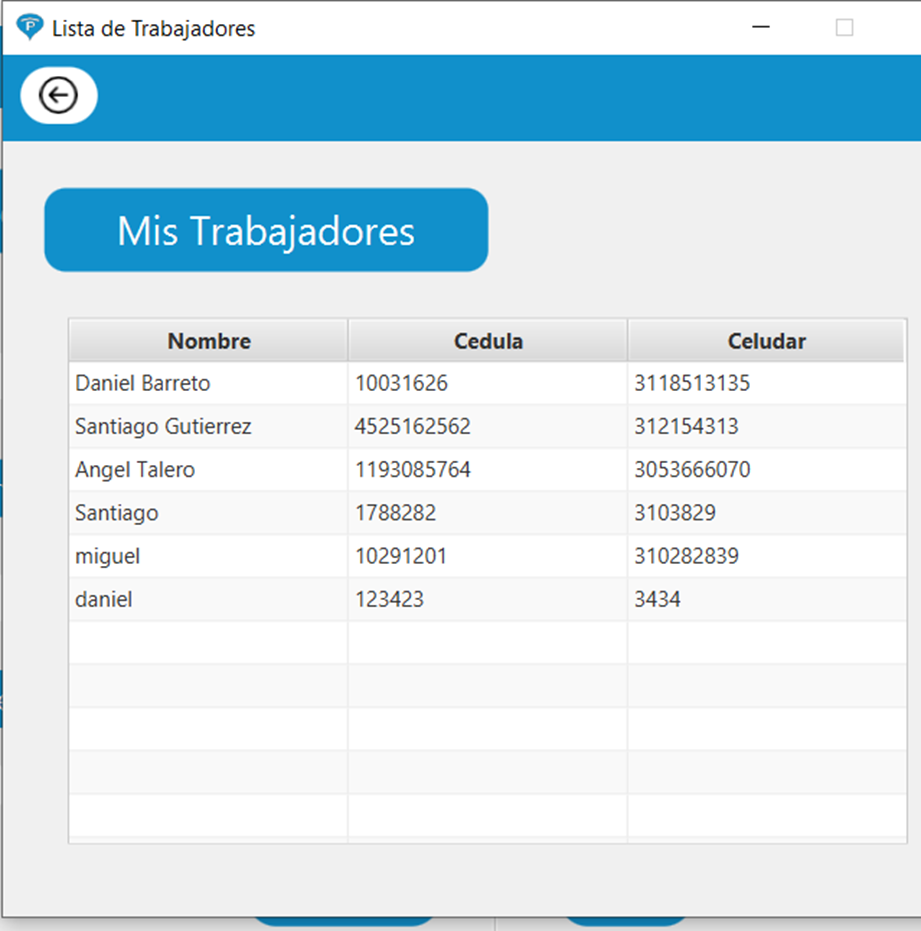
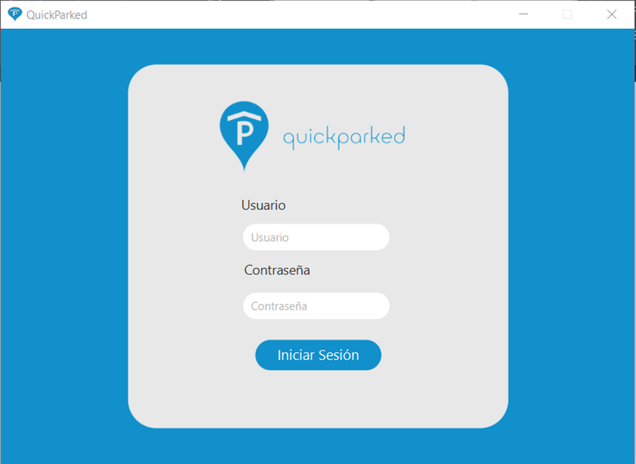
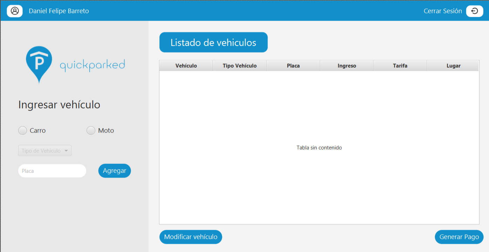
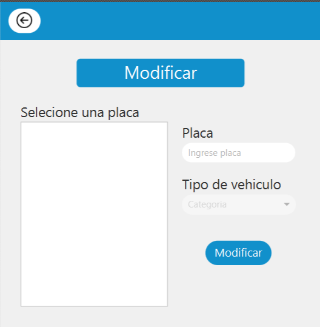
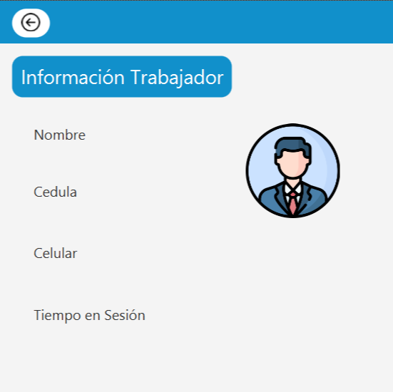
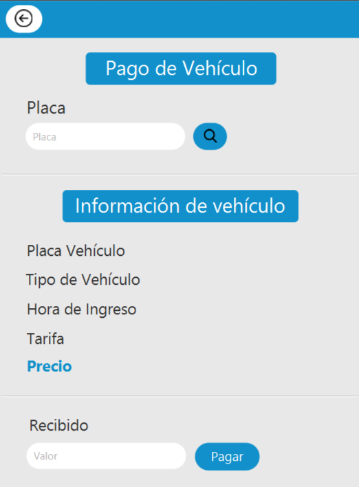

# QuickParked
Guia de uso para la aplicacion QuickParked
Bienvenido señor/a Trabajador este es una guia en donde describiremos el paso a paso de la aplicacion.
para poder acceder a la base de datos tienen que tener la VPN de la Universidad Javerina si no la tiene por favor 
descargarla en el siguiente link y registrarse con su correo institucional (@javeriana.edu.co).
Link de descarga de la VPN de la Pontificia Universidad javeriana: https://arpuj.javeriana.edu.co/.
USUARIO ADMINISTRADOR

# 1.Inicio de sesion - Administradores
por favor señor/a administrador el usuario es Admin y la contraseña es Admin pra poder acceder a el listado y generacion 
de trabajadores.

2. Pantalla Información parqueadero - Administradores
En esta pantalla el administrador/a puede ver al lado izquierdo la informacion del parqueadero como son el nombre del 
parqueadero, la direccion, las tafifas por minuto, la cantidad de espacios disponibles y el boton de actualizar los valores del parqueado 
por si alguno de ellos fue cambiado. 
El lado derecho de podra registar a los trabajadores nuevos, se necesita la informacion del trabajador como el nombre, cedula, celular, 
nombre de usuario y contaseña el administrados es capaz de almacenar tantos trabajadores como el necesite.

El boton mis trabajadores despliega el listado de los trabajadores registrados por el administrador en el sistema.

.

# USUARIO - TRABAJADORES

# 1. Inicio de sesion - Trabajadores

Para poder ingresar a nuestra plataforma primero debe ser registrad@ por el administrador, si ya esta 
registrado por favor escriba su correo y contraseña asiganada en los espacios especificados la contraseña es sumunistrada por su 
administrador.

# 2. Pantalla listado de vehiculos - Trabajadores

Cuando se realizo la validacion del correo de manera exitosa se le despliega al trabajador/a la pantalla principal del parqueadero
la cual cuenta con toda la información actual de parqueadero; Carro registrados actualmente, ventana de modificacion, ventana de pago.
El trabajador selecciona el tipo de vehiculo, en caso de ser Carro escoge el Tipo de carro asi como su indetificador (Placa)

# 3. Modificar Vehiculo

El trabajador esta en la capacidad de modificar la información del vehiculo ingresado en el sistema. Para ello, el usurario escoge la placa del carro a modificar en la lista, mostrando la informacion del vehiculo seleccionado y asi que el trabajador pueda modificarla.

# 4. Información Trabajador

El Trabajador podra ver la informacion suministrada por el al administrador, seleccionando el boton de usuario (arriba a la derecha)
en este apartado se muestra, nombre, cedula, celular y hora de ingreso a la pataforma

# 5. Generar Pago

El trabajador esta en la capacidad de Realizar el pago de un vehiculo. Para ello, ingresa la placa del carro que va de salida, el sistema le muestra la informacion del vehiculo y el costo del servicio. Luego, el trabajador ingresa el monto pagado por el usuario del parqueadero.

